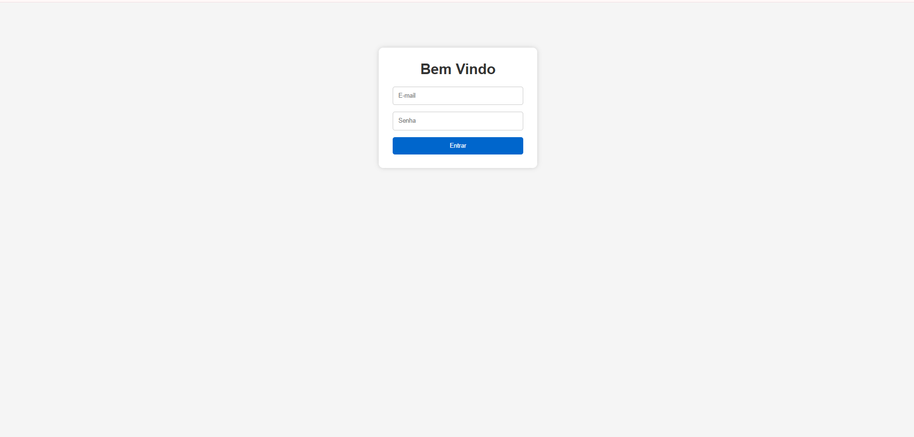
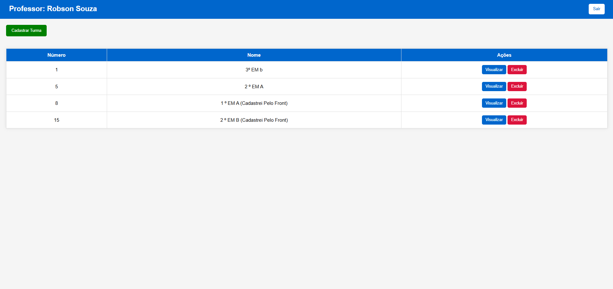
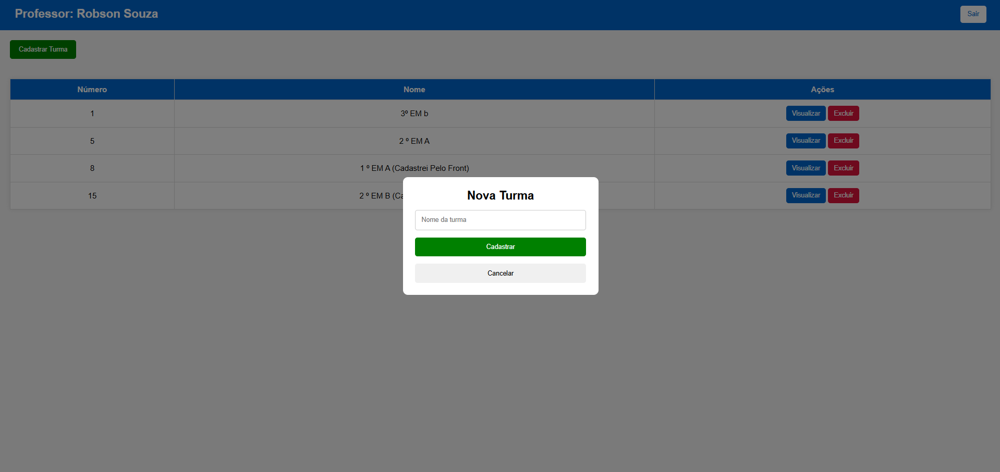
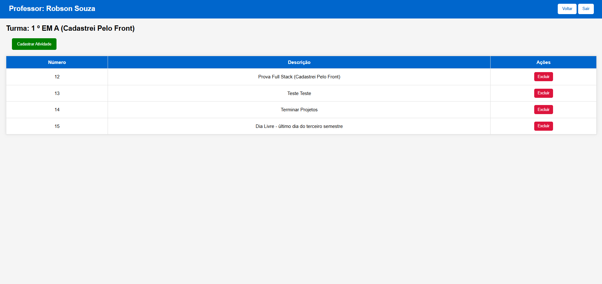
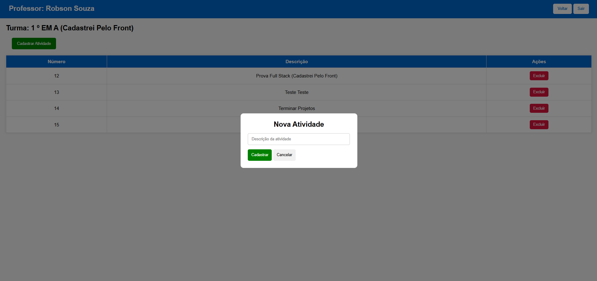
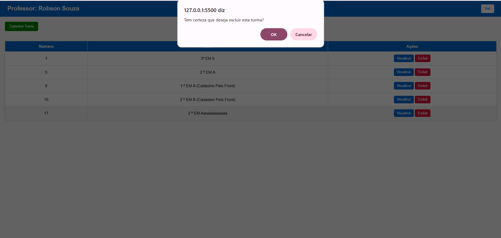
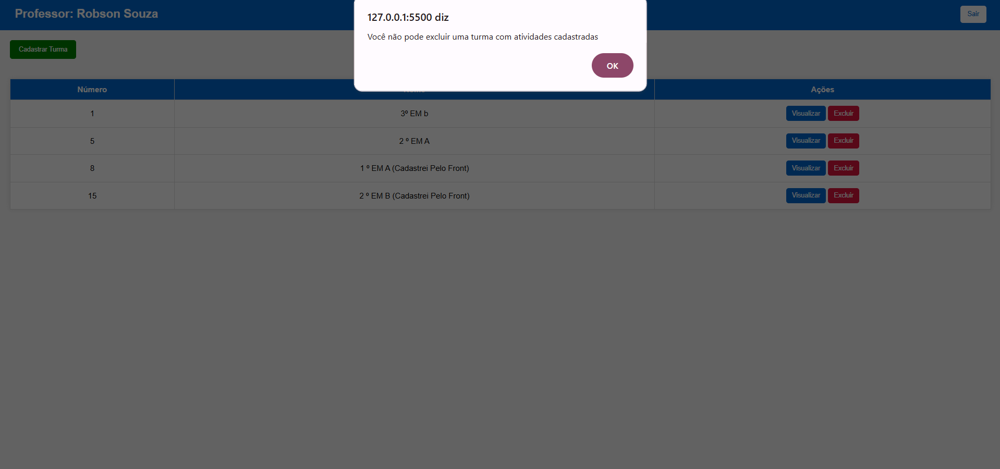
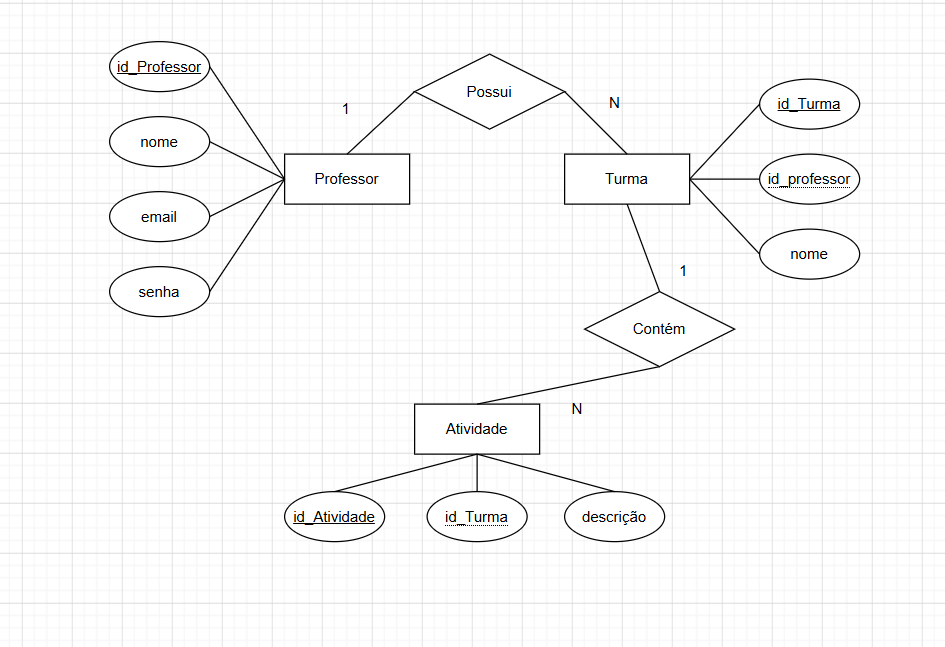

# Sistema de Gerenciamento de Turmas e Atividades

## 1. Requisitos de Infraestrutura

### Editor de Código (IDE)
- Visual Studio Code (VS Code) versão 1.90 ou superior.

### SGBD (Sistema Gerenciador de Banco de Dados)
- XAMPP 8.2
- MySQL 8.0

### Servidor de Aplicação
- Node.js v22.x
- NPM v10.x

### Linguagens Utilizadas

#### Back-end
- JavaScript ES2023
- Node.js v22.x
- Express.js v5.x
- Prisma ORM v6.x

#### Front-end
- HTML5
- CSS3
- JavaScript ES2023

### Dependências Utilizadas

- express
- cors
- dotenv
- prisma
- @prisma/client

Instalação das dependências:

```bash
npm install
```

---

# 2. Banco de Dados

Criar o banco de dados:

```sql
CREATE DATABASE turmas_db;
```

Executar as migrations do Prisma:

```bash
npx prisma migrate dev
```

Gerar o cliente Prisma:

```bash
npx prisma generate
```

---

# 3. Executando o Back-end

Abrir o terminal na pasta da API e executar:

```bash
node server.js
```

ou

```bash
npm start
```

O servidor será iniciado em:

```txt
http://localhost:3000
```

Para verificar se a API está funcionando, acesse uma rota de teste, por exemplo:

```txt
http://localhost:3000/professores/listar
```

---

# 4. Executando o Front-end

1. Abrir a pasta do front-end no VS Code.
2. Abrir o arquivo:

```txt
index.html
```

3. Recomenda-se utilizar a extensão **Live Server**.
4. Clicar com o botão direito no arquivo `index.html`.
5. Selecionar **Open with Live Server**.

O sistema abrirá automaticamente no navegador.

---

# 5. Usuários de Teste

Professores cadastrados no banco de dados:

| ID | Nome | Email | Senha |
|----|------|--------|--------|
| 1 | Robson Souza | robson@gmail.com | rob123 |
| 2 | Welligton Fabio | welli@gmail.com | welli123 |
| 3 | Reenye Lima | reenye@gmail.com | reenye123 |
| 5 | Pietra Moroni | pie@gmail.com | pie123 |

## Credenciais Recomendadas

Para uma melhor experiência durante a avaliação do sistema, utilize:

**Email:** `robson@gmail.com`

**Senha:** `rob123`

---

# 6. Tutorial de Teste do Sistema

## Testando o Back-end

### Listar Professores

Acesse:

```txt
http://localhost:3000/professores/listar
```

Resultado esperado:

```json
[
  {
    "id": 1,
    "nome": "Robson Souza",
    "email": "robson@gmail.com",
    "senha": "rob123"
  }
]
```

### Listar Turmas

Acesse:

```txt
http://localhost:3000/turmas/listar
```

Deverá retornar todas as turmas cadastradas.

### Listar Atividades

Acesse:

```txt
http://localhost:3000/atividades/listar
```

Deverá retornar todas as atividades cadastradas.

---

## Testando o Front-end

### Login

1. Abrir o sistema.
2. Informar:

**Email:**

```txt
robson@gmail.com
```

**Senha:**

```txt
rob123
```

3. Clicar em **Entrar**.
4. O sistema deverá redirecionar para a tela principal do professor.

---

### Cadastro de Turma

1. Na tela principal clicar em **Cadastrar Turma**.
2. Informar o nome da turma.
3. Clicar em **Cadastrar**.
4. A turma deverá aparecer na listagem.

---

### Listagem de Turmas

1. Após o login, verificar se apenas as turmas pertencentes ao professor autenticado são exibidas.
2. Cada turma deverá apresentar:
   - Número da turma.
   - Nome da turma.
   - Botão Visualizar.
   - Botão Excluir.

---

### Visualização das Atividades

1. Selecionar uma turma.
2. Clicar em **Visualizar**.
3. O sistema deverá exibir:
   - Nome do professor.
   - Nome da turma.
   - Número da atividade.
   - Descrição da atividade.

---

### Cadastro de Atividade

1. Na tela de atividades clicar em **Cadastrar Atividade**.
2. Informar uma descrição.
3. Clicar em **Cadastrar**.
4. A atividade deverá aparecer na listagem.

---

### Exclusão de Atividade

1. Selecionar uma atividade.
2. Clicar em **Excluir**.
3. Confirmar a operação.
4. A atividade deverá ser removida da listagem.

---

### Exclusão de Turma

1. Selecionar uma turma sem atividades.
2. Clicar em **Excluir**.
3. Confirmar a exclusão.
4. A turma deverá ser removida da listagem.

#### Regra de Negócio

Caso a turma possua atividades cadastradas, o sistema exibirá a mensagem:

```txt
Você não pode excluir uma turma com atividades cadastradas
```

e a exclusão não será realizada.

---

### Logout

1. Clicar em **Sair**.
2. A sessão do usuário será encerrada.
3. O sistema retornará para a tela de login.

---

# 7. Prints das Telas Principais

## Tela de Login


---

## Tela Principal do Professor


---

## Modal de Cadastro de Turma


---

## Tela de Atividades da Turma


---

## Modal de Cadastro de Atividade


---

## Confirmação de Exclusão de Turma


---

## Mensagem de Bloqueio de Exclusão de Turma com Atividades


---

# 8. DER




## Autora

Sistema desenvolvido para a disciplina de Desenvolvimento de Sistemas, utilizando Node.js, Express, Prisma ORM, MySQL, HTML, CSS e JavaScript por Pietra Moroni 2º DES B